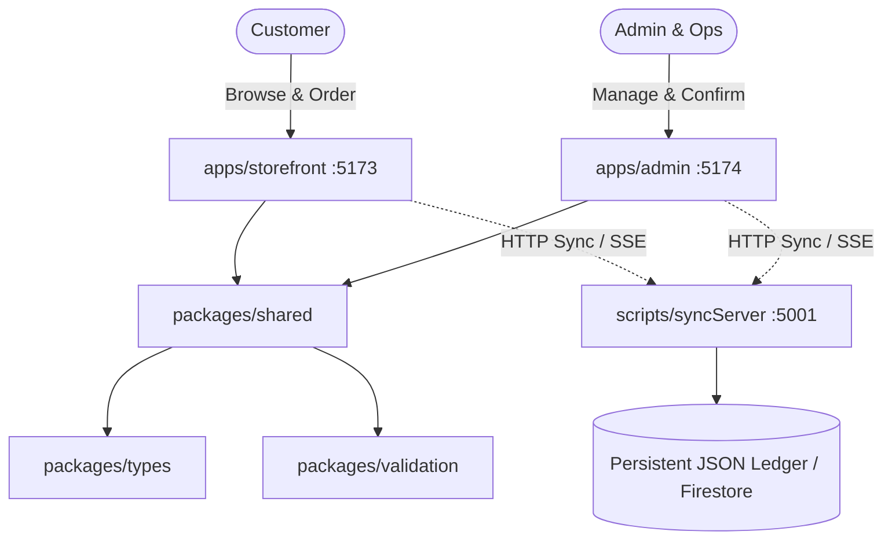

# System Architecture & Technical Specifications

## 1. High-Level Architecture Overview

Tea Nest is built as an enterprise-grade modular monorepo that strictly decouples domain logic, UI applications, and cloud services:



---

## 2. Monorepo Structure

| Package | Path | Responsibility |
|---|---|---|
| `@tea-nest/types` | `packages/types` | Domain TypeScript interfaces, enums, DTOs, and state contracts. |
| `@tea-nest/validation` | `packages/validation` | Zod runtime verification schemas for orders, products, purchases, and settings. |
| `@tea-nest/shared` | `packages/shared` | Core business algorithms: GST calculations, inventory threshold watcher, currency & number-to-words formatters, `OrderService` mutex-protected transaction manager, and reactive state stores. |
| `@tea-nest/storefront` | `apps/storefront` | Premium luxury customer portal with responsive navigation, adaptive WhatsApp order flow, product showcase, and order tracking. |
| `@tea-nest/admin` | `apps/admin` | Enterprise ERP & CRM system featuring real-time KPI metrics, stock adjustment ledger, purchase order intake, GST invoice generation, and P&L financial analysis. |

---

## 3. Core Business Workflows

### 3.1 Adaptive Commerce Flow
- **When 1 Product in Catalog**:
  - The storefront dynamically exposes an authenticated "ORDER ON WHATSAPP" primary action.
  - Clicking this checks authentication: if not logged in, opens a customer registration modal (name, mobile, delivery address).
  - Generates a persistent order record in status `WHATSAPP_PENDING` with order ID `TN-2026-XXXXXX`.
  - **Stock is NOT deducted** at intent creation.
  - Constructs a pre-filled, URL-encoded WhatsApp message to the business WhatsApp number:
    ```
    *NEW TEA NEST ORDER INTENT*
    Order ID: TN-2026-000001
    Product: Assam Black Tea (500g)
    Qty: 1
    Total: Rs 450 (Incl. 5% GST)
    Customer: Rahul Sharma (9876543210)
    Delivery Address: Naharkatia Estate Delivery Point, Dibrugarh, Assam - 786610
    ```
  - Redirects or provides a direct link to WhatsApp web/app.

- **When Multiple Products in Catalog**:
  - The storefront enables full cart state (`CartPage.tsx`), quantity selectors, multi-item checkout, and server-side stock availability validation.

---

### 3.2 Atomic Order Confirmation & Concurrency Protection
All order confirmations are executed via `OrderService.confirmOrder()`:
1. **Mutex Queue**: Enforces single-threaded execution per transaction using an in-memory Promise queue, preventing race conditions.
2. **Stock Verification**: Inspects `stockQuantity` against ordered item quantities. If insufficient, immediately throws an error: `Insufficient stock for product <name> (Available: X, Requested: Y)`.
3. **Atomic State Updates**:
   - Updates order status: `status = 'CONFIRMED'`.
   - Decrements stock: `product.stockQuantity -= item.quantity`.
   - Records inventory movement: `type = 'OUTBOUND_SALE'`, with `beforeQuantity` and `afterQuantity`.
   - Generates sequential GST Tax Invoice: `INV-2026-XXXXXX` with CGST 2.5% + SGST 2.5% (or IGST 5%), HSN 0902, and amount in words.
   - Generates sales ledger entry: `Sale` record linked to customer and invoice.
   - Triggers low-stock alert if `stockQuantity < lowStockThresholdQty`.
   - Appends entry to `crmTimeline` and `auditLogs`.

---

## 4. GST Taxation & Math Engine

Compliant with Indian Goods and Services Tax Act:
- **HSN Code**: `0902`
- **Applicable Rate**: 5%
- **Tax-Inclusive Formula**:
  $$\text{Taxable Value} = \text{Round}\left(\frac{\text{MRP}}{1 + \frac{\text{GST Rate}}{100}}\right) = \text{Round}\left(\frac{450}{1.05}\right) = 428.57 \approx 429$$
  $$\text{Total GST} = 450 - 428.57 = 21.43 \approx 21$$
  $$\text{CGST (2.5\%)} = 10.71 \approx 11, \quad \text{SGST (2.5\%)} = 10.71 \approx 11$$

---

## 5. Automated Low-Stock Calculation

$$ \text{Threshold Quantity} = \left\lceil \text{stockReferenceQty} \times \frac{\text{lowStockPercent}}{100} \right\rceil $$
- For `stockReferenceQty = 100` and `lowStockPercent = 70`:
  $$ \text{Threshold} = \lceil 100 \times 0.70 \rceil = 70 \text{ units} $$
- An alert is automatically fired whenever current on-hand stock falls below 70 units.
