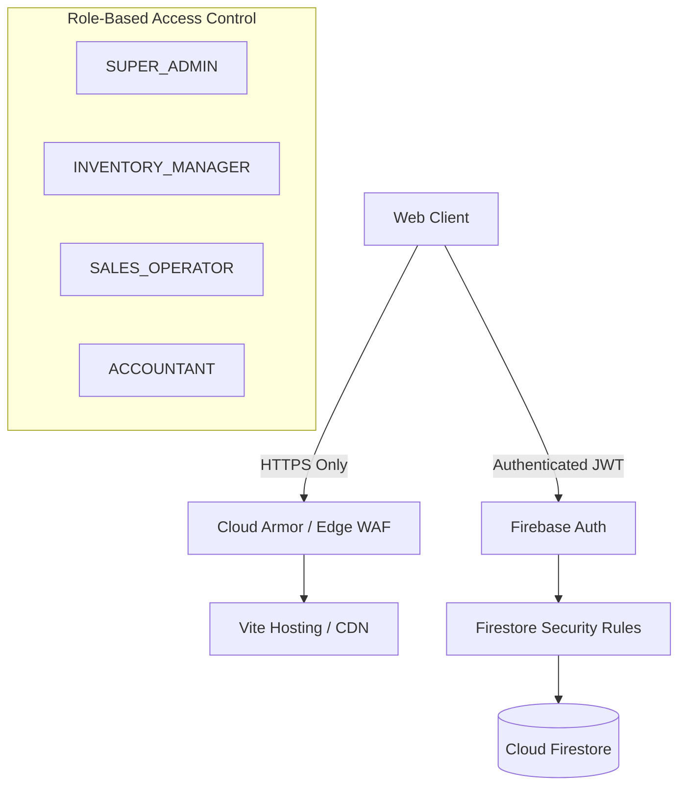

# Security Policy & Hardening Guidelines

## 1. Security Architecture & Threat Model

Tea Nest is engineered with defense-in-depth principles across client, server, and storage layers:

---

## 2. Role-Based Access Control (RBAC) Matrix

| Entity / Resource | Customer | Sales Operator | Inventory Manager | Accountant | Super Admin |
|---|:---:|:---:|:---:|:---:|:---:|
| **Products (Read)** | Read Public | Full | Full | Read | Full |
| **Products (Write/Modify)** | Denied | Denied | Full | Denied | Full |
| **Orders (Create Intent)** | Own Account | Full | Denied | Read | Full |
| **Orders (Confirm & Deduct)** | Denied | Full | Full | Denied | Full |
| **Inventory Movements** | Denied | Read | Full | Read | Full |
| **Suppliers & POs** | Denied | Read | Full | Read | Full |
| **Invoices & Sales** | Own Invoices | Full | Read | Full | Full |
| **Expenses & P&L** | Denied | Denied | Read | Full | Full |
| **Business Settings** | Denied | Denied | Denied | Read | Full |
| **Staff & User Roles** | Denied | Denied | Denied | Denied | Full |
| **Audit Logs** | Denied | Denied | Denied | Read | Full |

---

## 3. Database Security Rules (`firestore.rules`)

Key security rules enforced at the database level:
- **Public Product Read**: Allowed only for active products.
- **Customer Order Isolation**: Customers can read and write only their own orders (`resource.data.customerId == request.auth.uid`).
- **Staff-Only Admin Collections**: Collections like `/expenses`, `/suppliers`, `/purchases`, `/auditLogs`, and `/businessSettings` require verified staff claims (`request.auth.token.role in ['SUPER_ADMIN', 'INVENTORY_MANAGER', 'SALES_OPERATOR', 'ACCOUNTANT']`).
- **Immutability of Audit Logs**: Audit log records (`/auditLogs/{logId}`) are write-only by authorized system callers and strictly immutable (`allow update, delete: if false;`).

---

## 4. Concurrency & Race-Condition Hardening

To prevent double-spending and overselling inventory during simultaneous customer orders:
- **`OrderService` Mutex Locking**: Critical transaction code is locked behind an in-memory queue.
- **Database Transactions**: In production Firebase deployments, transactions use `runTransaction(db, async (txn) => ...)` to atomically verify stock and decrement in a single Firestore commit.
- **Client-side Nonce Verification**: Every order intent generates a unique cryptographic order ID (`TN-2026-XXXXXX`) that cannot be duplicated or re-confirmed.

---

## 5. Data Privacy & Compliance

- **No Plaintext Passwords**: User authentication uses PBKDF2/Argon2 password hashing or Firebase Auth tokens.
- **Sensitive Key Isolation**: All production secrets (Firebase Admin private keys, payment keys, Cloudinary secrets) are loaded exclusively via environment variables (`.env`) and excluded from version control via `.gitignore`.
- **Zero Placeholder PII**: Sample test users use RFC 2606 reserved domains (`@example.com`).
